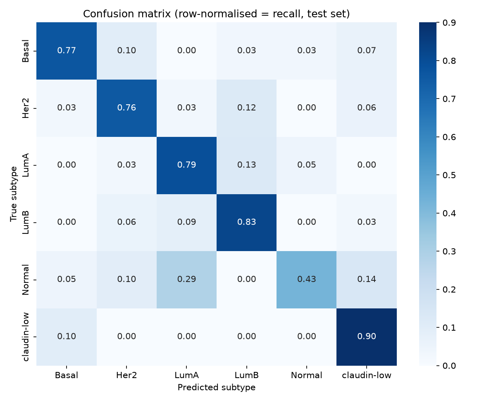
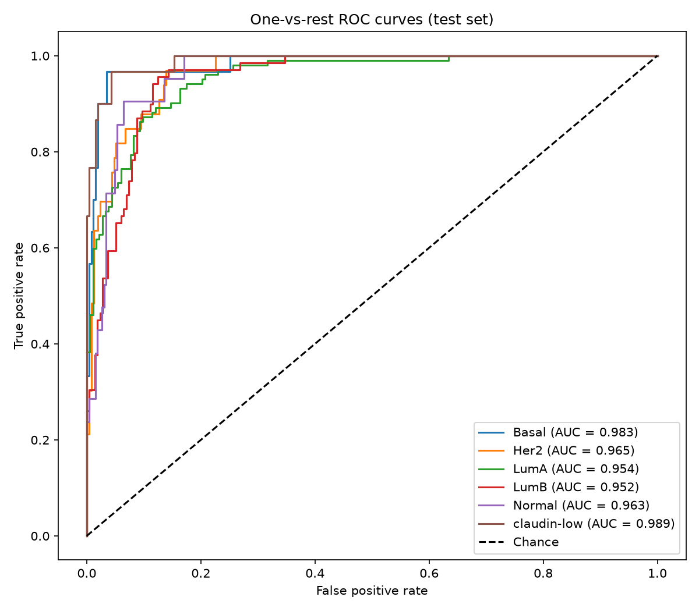
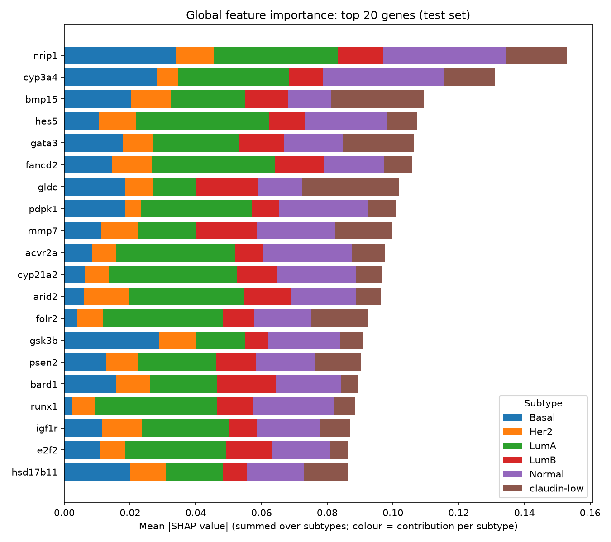
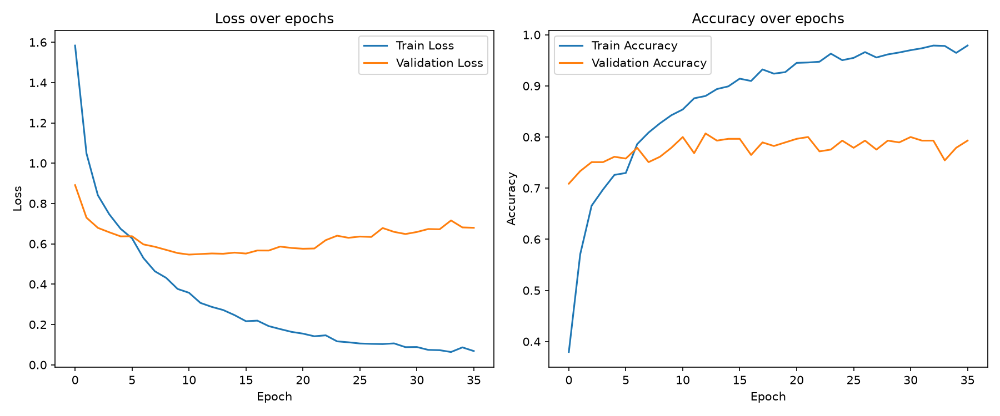

# Breast Cancer Molecular Subtype Classification (METABRIC, Deep Neural Network)

Multi-class classification of breast cancer molecular subtypes
(Basal, Her2, LumA, LumB, Normal, claudin-low) from gene expression data,
using a feed-forward deep neural network (TensorFlow/Keras), with
SHAP-based model explainability.

## Pipeline
| Step | Script | What it does |
|---|---|---|
| 1 | src/01_data_exploration.py | Explore dataset and column summaries |
| 2 | src/02_preprocessing.py | Clean, encode labels, split, scale |
| 3 | src/03_feature_selection.py | ANOVA-based gene feature selection |
| 4 | src/04_train_model.py | Train the DNN |
| 5 | src/05_evaluate_model.py | Test-set metrics, confusion matrix, ROC |
| 6 | src/06_explain_model.py | SHAP global and per-class gene importance |
| 7 | src/07_predict.py | Predict on new samples |

## Results (held-out test set, n = 285)
| Metric | Value |
|---|---|
| Accuracy | 0.779 (95% CI 0.733 to 0.825) |
| Balanced accuracy | 0.746 |
| Macro F1 | 0.741 (95% CI 0.677 to 0.796) |
| Weighted F1 | 0.777 |
| MCC | 0.716 |
| Macro ROC-AUC (OvR) | 0.968 |

Per-class ROC-AUC: Basal 0.983, Her2 0.965, LumA 0.954, LumB 0.952,
Normal 0.963, claudin-low 0.989.

## Data
Download the METABRIC dataset from [Kaggle (Breast Cancer Gene Expression Profiles, METABRIC)](https://www.kaggle.com/datasets/raghadalharbi/breast-cancer-gene-expression-profiles-metabric) and place it at
`data/raw/METABRIC_RNA_Mutation.csv`.

## How to run
    python -m venv .venv
    .venv\Scripts\activate
    pip install -r requirements.txt
    python src/01_data_exploration.py
    python src/02_preprocessing.py
    python src/03_feature_selection.py
    python src/04_train_model.py
    python src/05_evaluate_model.py
    python src/06_explain_model.py

## Limitations
- Single dataset, no external validation cohort.
- Most errors occur between closely related subtypes (LumA/LumB, Normal/claudin-low)..
- Subtype labels come from the dataset, not re-derived.
- Class imbalance may affect minority-class performance.

## Tools
Python, TensorFlow/Keras, scikit-learn, pandas, SHAP, matplotlib.